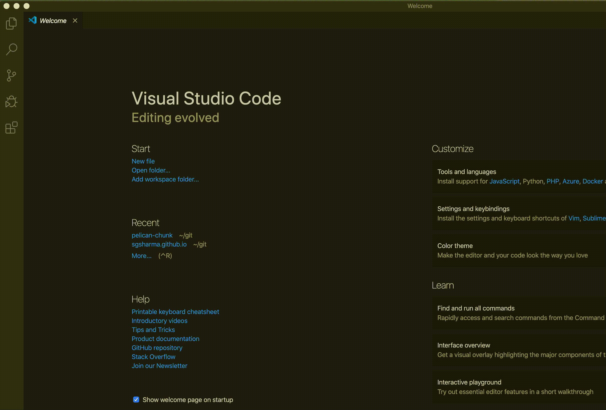

Title: In which I set up my Macbook. Again.
Date: 2020-02-13 13:13
Modified: 2020-02-13 13:13
Category: misc
Tags: first, misc
Slug: hello-world
Authors: Sasha Sharma
Summary: I left my job as a software engineer at the end of January and my La Croix-less days began. So I set about looking for a long-forgotten non-work-issue laptop and began installing all the things yet again

It's the kind of San Francisco gray day I like: nary a hint of sun and the world awash in gray tones worthy of a Seattle rainy day. A month ago, I'd have been at work, sipping pamplemousse sparkling water from a La Croix can (that's grapefruit if you didn't know; yeah I googled it). But I left my job as a software engineer at the end of January and my La Croix-less days began.

Although, my employers' snack game was pretty good (seriously, check out the [GH careers](https://guardanthealth.com/careers/jobs/) page), I found myself physically and emotionally exhausted at the end of an year that included fairly advanced tuberculosis for me, a broken femur for my SO, and TB + an allergic reaction to TB medication for my SO. As the kids these days might say, shit was wild. 

So, here I sit; TB-less, La Croix-less, jobless, dogless, on a break from the real world. I joined a gym, which has been nice (I can lift things folks!), I'm definitely running more, but mostly I've really missed making things, writing the codes and watching it bring something to life. Blogging about the codes seemed like a worthy alternative, I've always enjoyed talking to nobody in particular...

First, the inevitable search for a long-forgotten non-work issue laptop. Et voila, a 2014 13" Macbook pro presented itself and I am going to install all the things yet again:

### iTerm 

- Set up the [nice shortcuts](https://medium.com/@jonnyhaynes/jump-forwards-backwards-and-delete-a-word-in-iterm2-on-mac-os-43821511f0a)
- Set up the password manager with some [triggers](https://iterm2.com/documentation-triggers.html) to quickly fill in at annoying password prompts at ev-e-r-y commit...
- (bash specific) Fix the prompt colors and add git status; I've gathered a list of resources that have helped me set this up anew every time
    - To generate the PS colors and the git status pieces: [ezprompt](http://ezprompt.net/)
    - To make some text bold, [this](https://unix.stackexchange.com/questions/31695/how-to-make-the-terminal-display-usermachine-in-bold-letters) StackExchange thread has a good explain
    - To set up LS colors, [this](https://geoff.greer.fm/lscolors/) is pretty great 

    
### Python3 & Pip
<pre>
$ xcode-select --install
$ /usr/bin/ruby -e "$(curl -fsSL https://raw.githubusercontent.com/Homebrew/install/master/install)"
$ brew upgrade
$ brew doctor
</pre>

I was also unfortunate enough to have to manually brew link several stuffs

<pre>
$ for i in $(cat ./tmp.txt); do brew link $i; done
$ brew link --overwrite gnupg
$ echo 'export PATH="/usr/local/sbin:$PATH"' >> ~/.bash_profile
$ brew doctor
$ source ~/.bash_profile
$ brew install python3
</pre>

I <s>don't much care for brew</s> got a working install, yay! Next, install pip:

    $ curl https://bootstrap.pypa.io/get-pip.py -o get-pip.py

### Set up SSH key for my GitHub account 

Generate the key: 

    $ ssh-keygen -t rsa -b 4096 -C "<username>@<domain>.com"

Copy the contents of the .pub file generated under `New SSH Key` [here](https://github.com/settings/keys)

### VSCode
Yep, I became a convert from PyCharm + Sublime a year or so ago and haven't looked back. I still do use the Sublime key bindings though.

- Kick off the download [here](https://code.visualstudio.com/download). 
- Install the sublime keymap extension:

- Add the code command in path:

`Command (or Cmd) ⌘ + Shift ⇧ + p` should bring up the command palette. Type in 'shell command' to find the `Shell Command: Install 'code' command in PATH` command. ([Documentation here](https://code.visualstudio.com/docs/setup/mac#_launching-from-the-command-line))

And that's it, I've got a<s>nother</s> working setup! May the codes flow forth... 
